# MNIST模型部署教学项目

这是一个完整的MNIST手写数字识别模型部署教学项目，展示了从PyTorch训练到跨平台部署的完整流程。

## 项目结构

```
DL2C/
├── train/                          # 训练相关脚本
│   ├── train_model.py              # 模型训练
│   ├── quantize_model.py           # 模型量化
│   └── export_onnx.py              # ONNX导出
├── inference/                      # 推理相关代码
│   ├── python_inference.py        # Python推理（基础版本）
│   ├── cpp_inference.cpp          # C++推理（基础版本）
│   ├── c_inference.c              # C语言推理（基础版本）
│   ├── python_inference_common.py # Python推理（共同数据版本）
│   ├── cpp_inference_common.cpp   # C++推理（共同数据版本）
│   ├── c_inference_common.c       # C语言推理（共同数据版本）
│   ├── python_inference_mnist.py  # Python推理（真实MNIST版本）
│   ├── cpp_inference_mnist.cpp    # C++推理（真实MNIST版本）
│   └── c_inference_mnist.c        # C语言推理（真实MNIST版本）
├── build/                          # 编译配置
│   └── CMakeLists.txt              # CMake配置
├── models/                         # 模型文件目录
├── data/                           # 数据目录
├── results/                        # 结果文件目录
├── test_data_mnist/                # 真实MNIST测试数据目录
├── run_tutorial.py                 # 教学脚本
├── compare_languages.py            # 基础版本性能对比脚本
├── compare_common_data.py          # 共同数据性能对比脚本
├── compare_mnist_results.py        # 真实MNIST数据对比脚本
├── generate_common_test_data.py    # 生成共同测试数据脚本
├── mnist_data_loader.py            # 真实MNIST数据加载脚本
└── 使用说明.md                     # 本文件
```

## 快速开始

### 方法一：交互式教学（推荐）

直接运行教学脚本，它会一步一步引导您完成整个流程：

```bash
python run_tutorial.py
```

这个脚本会：
- 检查依赖环境
- 逐步执行每个步骤
- 提供详细的说明和错误处理
- 支持失败重试

### 方法二：手动执行

如果您想手动执行每个步骤，请按以下顺序：

#### 1. 安装依赖

```bash
pip install torch torchvision onnx onnxruntime numpy matplotlib Pillow
```

#### 2. 训练模型

```bash
cd train
python train_model.py
```

#### 3. 量化模型

```bash
python quantize_model.py
```

#### 4. 导出ONNX

```bash
python export_onnx.py
```

#### 5. Python推理测试

我们提供了三种不同的推理版本，适用于不同的测试场景：

**版本一：基础推理（原始版本）**
```bash
cd ../inference
python python_inference.py
```
- 使用随机生成或PIL图像数据
- 适合快速验证模型是否正常工作
- 主要用于功能测试

**版本二：共同数据推理**
```bash
# 首先生成共同测试数据（如果还没有）
python generate_common_test_data.py

# 运行共同数据推理
python python_inference_common.py
```
- 使用预先生成的固定测试数据集
- 确保多种语言使用完全相同的输入
- 适合语言间一致性验证

**版本三：真实MNIST推理（推荐）**
```bash
# 首先生成真实MNIST测试数据
python mnist_data_loader.py

# 运行真实MNIST推理
python python_inference_mnist.py
```
- 使用真实的MNIST测试集数据
- 提供最真实的性能评估
- 符合学术和工业界标准

#### 6. 安装ONNX Runtime C++库

使用Homebrew安装（推荐）：
```bash
brew install onnxruntime
```

或从官网下载预编译版本：
https://github.com/microsoft/onnxruntime/releases

#### 7. 编译C++版本

```bash
cd ../build
mkdir build_macos && cd build_macos
cmake -DCMAKE_BUILD_TYPE=Release ..
make -j4
```

#### 8. 运行C++推理

同样提供三种不同版本：

**版本一：基础推理（原始版本）**
```bash
./bin/mnist_inference_cpp
```

**版本二：共同数据推理**
```bash
./bin/mnist_inference_cpp_common
```

**版本三：真实MNIST推理（推荐）**
```bash
./bin/mnist_inference_cpp_mnist
```

#### 9. 运行C语言推理

对应的C语言版本：

**版本一：基础推理（原始版本）**
```bash
./bin/mnist_inference_c
```

**版本二：共同数据推理**
```bash
./bin/mnist_inference_c_common
```

**版本三：真实MNIST推理（推荐）**
```bash
./bin/mnist_inference_c_mnist
```

#### 10. 三种语言性能对比

根据使用的数据版本，我们提供了不同的对比脚本：

**基础性能对比**
```bash
cd ../..
python compare_languages.py
```
- 对比基础版本的推理结果
- 主要关注FPS性能

**共同数据对比**
```bash
python compare_common_data.py
```
- 对比使用相同输入数据的结果
- 验证实现一致性和性能差异

**真实MNIST数据对比（推荐）**
```bash
python compare_mnist_results.py
```
- 基于真实MNIST测试数据的全面对比
- 包括准确率、性能、错误样本分析
- 生成详细的可视化报告

## 学习要点

### 1. PyTorch模型训练
- 简单的CNN架构设计
- 数据预处理和增强
- 训练循环和验证

### 2. 模型量化
- 动态量化技术
- 精度vs性能权衡
- 量化前后对比

### 3. ONNX导出
- 跨平台模型格式
- 模型验证和测试
- 动态维度支持

### 4. 推理引擎与测试版本
- **基础版本**: 快速功能验证，使用随机或简单数据
- **共同数据版本**: 多语言一致性测试，使用相同输入数据
- **真实MNIST版本**: 标准基准测试，使用真实MNIST数据集
- Python/C++/C三种语言API的使用
- 全面的性能和准确性对比分析

### 5. 跨平台部署
- macOS本地开发
- C++编译配置
- 性能优化选项

## 常见问题

### Q: 训练很慢怎么办？
A: 可以减少epochs数量（在`train_model.py`中修改），或使用更小的数据集进行快速验证。

### Q: ONNX Runtime找不到怎么办？
A: 
1. 首先尝试`brew install onnxruntime`
2. 如果失败，从GitHub下载预编译版本
3. 确保路径配置正确

### Q: C++/C编译失败怎么办？
A: 
1. 检查是否安装了ONNX Runtime
2. 确保CMake和编译器版本兼容
3. 查看详细错误信息
4. 对于C语言版本，确保链接了数学库(-lm)

### Q: 推理结果不一致怎么办？
A: 
1. 检查预处理步骤是否一致
2. 确认数据类型和维度匹配
3. 验证ONNX模型导出是否正确

### Q: 应该选择哪种语言进行部署？
A: 
1. **开发阶段**: Python (快速原型和验证)
2. **生产部署**: C/C++ (高性能和低资源占用)
3. **跨平台兼容**: C语言 (最广泛的兼容性)
4. **移动端**: C语言 (最小的运行时依赖)

### Q: 应该选择哪个推理版本？
A: 
1. **基础版本**: 
   - 适合快速功能验证
   - 检查模型是否正常加载和运行
   - 开发阶段的初步测试
2. **共同数据版本**: 
   - 验证多语言实现的一致性
   - 确保所有语言产生相同结果
   - 调试和验证阶段使用
3. **真实MNIST版本（推荐）**: 
   - 提供最准确的性能评估
   - 使用标准基准数据集
   - 适合正式的性能报告和比较
   - 符合学术和工业界标准

### Q: 三种版本的性能结果为什么不同？
A: 
1. **数据差异**: 不同版本使用不同的测试数据
2. **数据量差异**: 真实MNIST版本测试更多样本
3. **预处理差异**: 真实数据需要标准化处理
4. **评估维度**: 真实版本包含准确率评估

## 扩展学习

完成基础教程后，您可以尝试：

1. **数据集扩展**: 
   - 修改`mnist_data_loader.py`使用更多样本（1000或10000个）
   - 测试完整MNIST测试集的性能表现
   - 分析不同数据量对性能的影响

2. **自定义数据测试**: 
   - 使用自己的手写数字图片
   - 修改预处理流程适配新数据
   - 验证模型的泛化能力

3. **性能深度分析**: 
   - 分析三种语言的内存使用情况
   - 测试多线程推理性能
   - 比较不同ONNX Runtime优化选项

## Android 跨平台编译详细指南

### 环境依赖安装

在开始 Android 跨平台编译之前，需要安装以下环境和工具：

#### 1. 基础开发环境

```bash
# macOS 必备工具
brew install cmake ninja git wget curl

# 安装 Java 11 (ONNX Runtime 编译需要)
brew install openjdk@11
export PATH="/opt/homebrew/opt/openjdk@11/bin:$PATH"
```

#### 2. Android 开发环境

```bash
# 安装 Android NDK
brew install android-ndk
export ANDROID_NDK_HOME="/opt/homebrew/share/android-ndk"

# 安装 Android SDK 命令行工具
mkdir -p ~/android-sdk && cd ~/android-sdk
curl -O https://dl.google.com/android/repository/commandlinetools-mac-9477386_latest.zip
unzip commandlinetools-mac-9477386_latest.zip
mkdir -p cmdline-tools/latest
mv cmdline-tools/* cmdline-tools/latest/ 2>/dev/null || true

# 设置环境变量
export ANDROID_SDK_ROOT=$HOME/android-sdk
export PATH=$PATH:$ANDROID_SDK_ROOT/cmdline-tools/latest/bin

# 接受许可协议
yes | sdkmanager --licenses
```

#### 3. Python 开发环境

```bash
# 安装 Python 依赖
pip install torch torchvision onnx onnxruntime numpy matplotlib Pillow
```

### ONNX Runtime Android 版本编译

这是整个流程中最复杂的部分，需要从源码编译 ONNX Runtime 的 Android 版本。

#### 1. 克隆 ONNX Runtime 源码

```bash
cd /Users/mintisan/Workplaces  # 或您的工作目录
git clone --recursive https://github.com/Microsoft/onnxruntime.git
cd onnxruntime
```

#### 2. 编译 Android 版本 (预计 30-60 分钟)

```bash
# 设置环境变量
export ANDROID_NDK_HOME="/opt/homebrew/share/android-ndk"
export ANDROID_SDK_ROOT="$HOME/android-sdk"
export PATH="/opt/homebrew/opt/openjdk@11/bin:$PATH"

# 开始编译 (这是一个耗时的过程)
./build.sh --android \
  --android_abi arm64-v8a \
  --android_api 21 \
  --android_sdk_path $ANDROID_SDK_ROOT \
  --android_ndk_path $ANDROID_NDK_HOME \
  --config Release \
  --minimal_build \
  --cmake_extra_defines onnxruntime_USE_KLEIDIAI=OFF
```

#### 3. 验证编译结果

```bash
# 检查生成的库文件
ls -la build/Android/Release/libonnxruntime_*.a

# 应该看到以下文件:
# libonnxruntime_session.a
# libonnxruntime_providers.a  
# libonnxruntime_framework.a
# libonnxruntime_graph.a
# 等等...
```

### Android 项目编译步骤

#### 1. 准备项目环境

```bash
cd /path/to/DL2C  # 返回到您的项目目录

# 确保已完成本地训练和模型导出
python train/train_model.py
python train/export_onnx.py

# 生成测试数据
python mnist_data_loader.py
```

#### 2. 执行 Android 交叉编译

```bash
cd build

# 方案一: 使用真实 ONNX Runtime (复杂但功能完整)
export ANDROID_NDK_HOME="/opt/homebrew/share/android-ndk"
export PATH="/opt/homebrew/opt/openjdk@11/bin:$PATH"
./build_android_real_onnx.sh

# 方案二: 使用简化版本 (推荐用于学习和验证)
./build_android_simple.sh
```

#### 3. 部署到 Android 设备

```bash
# 连接 Android 设备并开启开发者选项中的 USB 调试
adb devices  # 确认设备已连接

# 部署和测试
./deploy_and_test_simple.sh  # 或 ./deploy_and_test_real_onnx.sh
```

### 编译过程详解

#### CMake 配置参数说明

```cmake
# Android 专用配置
-DCMAKE_TOOLCHAIN_FILE="$ANDROID_NDK_HOME/build/cmake/android.toolchain.cmake"
-DANDROID_ABI=arm64-v8a          # 目标架构
-DANDROID_NATIVE_API_LEVEL=21    # 最低 API 级别
-DCMAKE_BUILD_TYPE=Release       # 发布版本优化
-DCMAKE_CXX_STANDARD=17          # C++ 标准
```

#### 链接库依赖顺序

ONNX Runtime 的链接顺序非常重要，错误的顺序会导致链接失败：

```cmake
# 正确的链接顺序
libonnxruntime_session.a      # 会话管理
libonnxruntime_providers.a    # 执行提供者 (最大的库)
libonnxruntime_framework.a    # 核心框架
libonnxruntime_graph.a        # 图操作
libonnxruntime_optimizer.a    # 优化器
libonnxruntime_util.a         # 工具函数
libonnxruntime_mlas.a         # 数学库
libonnxruntime_common.a       # 通用组件
# ... 第三方库
```

### 常见问题和解决方案

#### 1. NDK 版本兼容性

```bash
# 如果遇到编译错误，尝试使用特定版本的 NDK
# 推荐使用 NDK 25 或更新版本
brew uninstall android-ndk
# 手动下载并安装特定版本
```

#### 2. 内存不足

```bash
# ONNX Runtime 编译需要大量内存 (建议 8GB+)
# 如果内存不足，减少并行编译线程
make -j2  # 而不是 make -j4
```

#### 3. 依赖库缺失

```bash
# 确保所有依赖库都正确安装
brew list | grep -E "(cmake|ninja|protobuf)"

# 如果缺失，重新安装
brew install cmake ninja protobuf
```

#### 4. 链接错误

```bash
# 如果遇到链接错误，检查库的完整性
find /Users/mintisan/Workplaces/onnxruntime/build/Android/Release -name "*.a" -exec ls -la {} \;

# 确保所有 .a 文件都存在且大小合理 (不为 0)
```

### Android 跨平台编译依赖关系图

Android 跨平台编译涉及复杂的依赖关系，下图展示了完整的依赖结构：

```mermaid
graph TB
    %% 环境依赖层
    subgraph ENV["🔧 环境依赖层"]
        direction TB
        macOS["macOS Apple Silicon"]
        brew["Homebrew 包管理器"]
        java["Java 11 OpenJDK"]
        cmake["CMake + Ninja"]
        git["Git + 开发工具"]
        
        macOS --> brew
        brew --> java
        brew --> cmake 
        brew --> git
    end
    
    %% Android 工具链
    subgraph ANDROID["📱 Android 工具链"]
        direction TB
        ndk["Android NDK<br/>(Clang 19.0.1)"]
        sdk["Android SDK<br/>(命令行工具)"]
        toolchain["android.toolchain.cmake"]
        
        ndk --> toolchain
        sdk --> ndk
    end
    
    %% Python 环境
    subgraph PYTHON["🐍 Python 环境"]
        direction TB
        pytorch["PyTorch"]
        onnx["ONNX"]
        onnxrt["ONNX Runtime"]
        numpy["NumPy + 其他库"]
        
        pytorch --> onnx
        onnx --> onnxrt
    end
    
    %% 源码层
    subgraph SOURCE["📦 源码编译层"]
        direction TB
        ort_src["ONNX Runtime 源码<br/>(~2GB, 递归克隆)"]
        dl2c_src["DL2C 项目源码"]
        
        subgraph ORT_BUILD["ONNX Runtime 编译<br/>(30-60分钟)"]
            direction LR
            config["CMake 配置<br/>--android"]
            compile["编译<br/>(ARM64)"]
            libs["生成静态库<br/>(.a 文件)"]
            
            config --> compile --> libs
        end
        
        ort_src --> ORT_BUILD
    end
    
    %% 库依赖层 (复杂！)
    subgraph LIBS["📚 库依赖层 (按链接顺序)"]
        direction TB
        
        subgraph ONNX_LIBS["ONNX Runtime 核心库"]
            direction TB
            session["libonnxruntime_session.a<br/>(会话管理)"]
            providers["libonnxruntime_providers.a<br/>(执行提供者 - 最大 45MB)"]
            framework["libonnxruntime_framework.a<br/>(核心框架)"]
            graph_ops["libonnxruntime_graph.a<br/>(图操作)"]
            optimizer["libonnxruntime_optimizer.a<br/>(优化器)"]
            util["libonnxruntime_util.a<br/>(工具函数)"]
            mlas["libonnxruntime_mlas.a<br/>(数学库)"]
            common["libonnxruntime_common.a<br/>(通用组件)"]
            
            session --> providers
            providers --> framework
            framework --> graph_ops
            graph_ops --> optimizer
            optimizer --> util
            util --> mlas
            mlas --> common
        end
        
        subgraph THIRD_PARTY["第三方依赖库"]
            direction TB
            onnx_lib["libonnx.a<br/>(ONNX 协议)"]
            protobuf["libprotobuf-lite.a<br/>(序列化)"]
            cpuinfo["libcpuinfo.a<br/>(CPU 检测)"]
            re2["libre2.a<br/>(正则表达式)"]
            abseil["Abseil C++ 库<br/>(Google 基础库)"]
            
            onnx_lib --> protobuf
            protobuf --> cpuinfo
            cpuinfo --> re2
            re2 --> abseil
        end
        
        ONNX_LIBS --> THIRD_PARTY
    end
    
    %% 编译构建层
    subgraph BUILD["🔨 编译构建层"]
        direction TB
        
        subgraph SIMPLE["简化版本 (推荐学习)"]
            direction LR
            simple_cpp["simple_android_inference.cpp"]
            simple_c["simple_android_inference.c"]
            simple_build["CMake + NDK<br/>交叉编译"]
            simple_exe["ARM64 可执行文件<br/>(~50KB)"]
            
            simple_cpp --> simple_build
            simple_c --> simple_build
            simple_build --> simple_exe
        end
        
        subgraph REAL["真实 ONNX 版本"]
            direction LR
            real_cpp["android_real_onnx_inference.cpp"]
            real_cmake["复杂 CMake 配置<br/>(链接所有库)"]
            real_exe["完整功能可执行文件<br/>(~20MB+)"]
            
            real_cpp --> real_cmake
            real_cmake --> real_exe
        end
    end
    
    %% 部署层
    subgraph DEPLOY["🚀 部署运行层"]
        direction TB
        adb["ADB 工具"]
        device["Android 设备<br/>(ARM64, API 21+)"]
        push["文件推送<br/>(模型+可执行文件)"]
        execute["设备上执行<br/>推理测试"]
        results["性能结果<br/>对比分析"]
        
        adb --> device
        device --> push
        push --> execute
        execute --> results
    end
    
    %% 依赖关系连接
    ENV --> ANDROID
    ENV --> PYTHON
    ANDROID --> SOURCE
    PYTHON --> SOURCE
    SOURCE --> LIBS
    LIBS --> BUILD
    BUILD --> DEPLOY
    
    %% 复杂度标注
    classDef simple fill:#90EE90,stroke:#333,stroke-width:2px
    classDef complex fill:#FFB6C1,stroke:#333,stroke-width:2px
    classDef critical fill:#FFD700,stroke:#333,stroke-width:2px
    
    class SIMPLE simple
    class LIBS,ORT_BUILD complex
    class ANDROID,DEPLOY critical
```



#### 复杂度分析

从上图可以看出，Android 跨平台编译确实非常复杂，主要体现在：

1. **🔧 环境依赖层 (黄色 - 关键)**
   - 需要正确配置 macOS 开发环境
   - Homebrew 包管理器安装多个工具
   - Java 11 是 ONNX Runtime 编译的硬性要求

2. **📱 Android 工具链 (黄色 - 关键)**
   - NDK 版本兼容性要求严格
   - SDK 命令行工具配置复杂
   - 交叉编译工具链设置容易出错

3. **📚 库依赖层 (红色 - 最复杂)**
   - **10+ 个 ONNX Runtime 核心库**，链接顺序关键
   - **5+ 个第三方库**，版本兼容性要求
   - `libonnxruntime_providers.a` 单个文件可达 45MB
   - Abseil C++ 库包含数十个子库

4. **📦 源码编译层 (红色 - 耗时)**
   - ONNX Runtime 源码约 2GB
   - 编译时间 30-60 分钟
   - 需要 8GB+ 内存

5. **🔨 编译构建层**
   - **简化版本 (绿色 - 推荐)**: 适合学习和验证
   - **真实版本**: 功能完整但复杂度高

6. **🚀 部署运行层 (黄色 - 关键)**
   - 需要 Android 设备和 ADB 工具
   - 文件传输和权限管理
   - 跨平台结果验证

#### 为什么选择简化版本？

基于复杂度分析，我们提供了两种方案：

| 特性 | 简化版本 ✅ | 真实 ONNX 版本 ⚠️ |
|------|-------------|-------------------|
| **编译时间** | < 5 分钟 | 30-60 分钟 |
| **依赖复杂度** | 低 | 极高 |
| **文件大小** | ~50KB | ~20MB+ |
| **学习价值** | 高 (专注核心概念) | 高 (完整工业实践) |
| **维护难度** | 低 | 高 |
| **成功率** | 95%+ | 70% (依赖问题) |

#### 推荐学习路径

1. **第一阶段**: 使用简化版本理解核心概念
2. **第二阶段**: 尝试真实 ONNX 版本，体验工业级复杂度
3. **第三阶段**: 根据实际需求选择合适方案

### 性能调优建议

#### 1. 编译优化选项

```cmake
# 添加更激进的优化选项
target_compile_options(android_inference PRIVATE
    -O3                    # 最高优化级别
    -ffast-math           # 快速数学运算
    -ffunction-sections   # 函数级别优化
    -fdata-sections       # 数据级别优化
    -DNDEBUG              # 禁用调试信息
)
```

#### 2. 链接时优化

```cmake
target_link_options(android_inference PRIVATE
    -Wl,--gc-sections     # 移除未使用的代码
    -flto                 # 链接时优化 (如果支持)
    -static-libstdc++     # 静态链接标准库
)
```

4. **Android/移动端部署高级功能**: 
   - 集成到 Android Studio 项目
   - 创建 JNI 接口用于 Java 调用
   - 开发实时相机识别应用
   - 添加 GPU 加速支持 (OpenCL/Vulkan)

5. **模型优化实验**: 
   - 尝试不同的量化方法
   - 使用ONNX优化工具
   - 比较模型大小和精度权衡

6. **实际应用开发**: 
   - 集成到手机或Web应用
   - 开发实时手写数字识别系统
   - 添加用户界面和交互功能

## 技术栈

- **训练框架**: PyTorch
- **推理引擎**: ONNX Runtime
- **编程语言**: Python, C++
- **构建系统**: CMake
- **平台支持**: macOS, Linux, Android

## 参考资源

- [PyTorch官方文档](https://pytorch.org/docs/)
- [ONNX Runtime文档](https://onnxruntime.ai/docs/)
- [ONNX格式规范](https://onnx.ai/)
- [CMake教程](https://cmake.org/cmake/help/latest/guide/tutorial/)

祝您学习愉快！🎓 

### Android 跨平台部署（真实ONNX版本推荐）

#### 1. 环境准备

```bash
brew install cmake ninja git wget curl openjdk@11 android-ndk
export ANDROID_NDK_HOME="/opt/homebrew/share/android-ndk"
export ANDROID_SDK_ROOT="$HOME/android-sdk"
export PATH="/opt/homebrew/opt/openjdk@11/bin:$PATH"
```

#### 2. 编译ONNX Runtime（完整ONNX支持）

```bash
cd ~/Workplaces
# 如未克隆请执行：
git clone --recursive https://github.com/Microsoft/onnxruntime.git
cd onnxruntime

# 编译（去掉--minimal_build，确保支持完整ONNX模型）
./build.sh --android \
  --android_abi arm64-v8a \
  --android_api 21 \
  --android_sdk_path $ANDROID_SDK_ROOT \
  --android_ndk_path $ANDROID_NDK_HOME \
  --config Release \
  --cmake_extra_defines onnxruntime_USE_KLEIDIAI=OFF
```

编译完成后，确认`build/Android/Release/`下有`libonnxruntime_session.a`等静态库。

#### 3. 数据与模型准备

```bash
# 生成MNIST测试数据和模型
python train/train_model.py
python train/export_onnx.py
python mnist_data_loader.py
```
确保`models/mnist_model.onnx`和`test_data_mnist/`目录下有数据和`metadata.json`。

#### 4. 编译Android推理程序

```bash
cd build
export ANDROID_NDK_HOME="/opt/homebrew/share/android-ndk"
export PATH="/opt/homebrew/opt/openjdk@11/bin:$PATH"
./build_android_real_onnx.sh
```

编译成功后，`android_executables/arm64-v8a/android_real_onnx_inference`为可部署文件。

#### 5. 部署与测试

```bash
# 确保设备已连接并开启USB调试
adb devices

# 部署并自动测试
./deploy_and_test_real_onnx.sh
```

脚本会自动推送可执行文件、模型、测试数据到设备并运行推理，结果会拉回到`results/`目录。

#### 6. 结果对齐与验证

- **Android与macOS本地C++推理结果应高度一致（准确率90%+）**
- **如准确率异常（如20%），请检查：**
  - Android端是否只读取784个float图像数据，标签需从`metadata.json`获取
  - 数据文件格式与本地一致
  - ONNX Runtime编译参数是否正确（无minimal_build）

#### 7. 性能对比与分析

```bash
python3 android_cross_platform_analysis.py
```

自动生成`results/android_cross_platform_final_report.md`和性能对比图。

---

#### 常见问题补充

- **Q: Android推理准确率远低于本地？**
  - 检查推理代码是否正确读取标签（不能从二进制文件头部读取标签，需用metadata.json）
  - 检查数据文件格式是否一致
  - 检查ONNX Runtime是否为完整版 